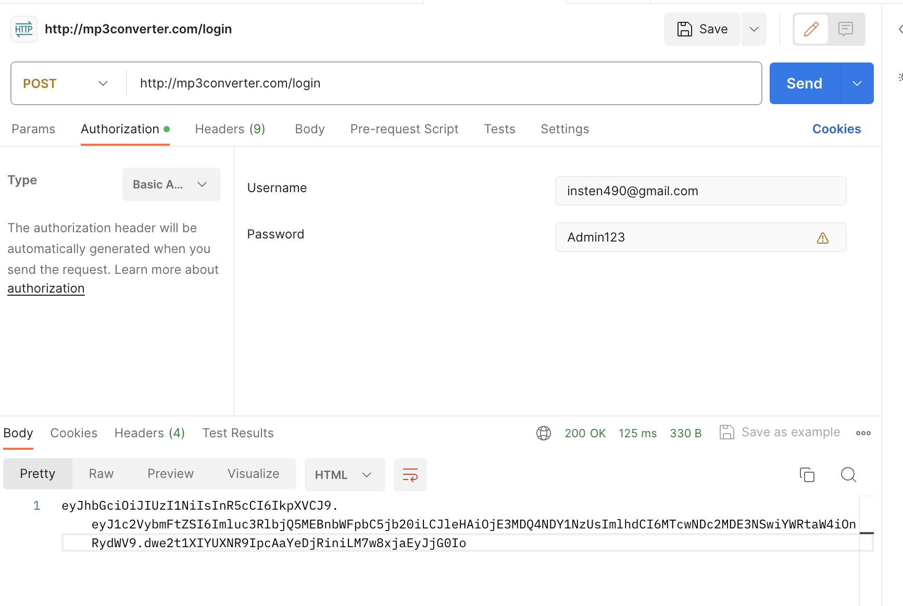

# video2mp3
App that converts video to an MP3 file and stores it in a database.

## How to use

This is a microservice application. Therefore, it needs to be deployed in several parts.

Each of the following applications contain a ```Dockerfile``` which needs to be run inside respective directory like so ```docker build .```

Afterwards, applications need to be tagged using ```docker tag <docker image id> <your repository name>:<version tag>```. 

Once images are tagged, push them to your repository ```docker push <image name>:<image tag>.```

Finally for each application, navigate to ```manifests``` folder and apply all YAML files using ```kubectl```: ```kubectl apply -f ./```

### Testing

Login method verified via Postman with BasicAuth credentials.




## System design

Below is a diagram depcicting complete microservice-based architecture which will process video upload requests and will allow to download MP3 files.


### How it works

There are eight components in this system:

* Client
* API Gateway
* Notification service
* Auth Service
* Video to MP3 service
* Storage DB
* Auth DB
* Message Queue

When a user uploads a video to be converted to an MP3 file, the request goes to API Gateway. The gateway sends the video file to the Video database (MongoDB). The Gateway also puts a message in a queue (RabbitMQ) to notify the downstream service that there is a video to be converted. The Video to MP3 service will consume the message from the queue. It will then get the ID of the video from the message, pull the video from the DB, convert the video to MP3, and store the MP3 file in the DB. The sevice then puts a new message in the queue to be consumed by the notification service to let the user know that the conversion job has finished. After reading the message, the notification service sends an email to the client with an MP3 ID. Client then uses the ID in combination with their JWT token to submit a request to API Gateway to download the file. Finally, the API Gateway will pull the file from MongoDB database and serve it to the client.
